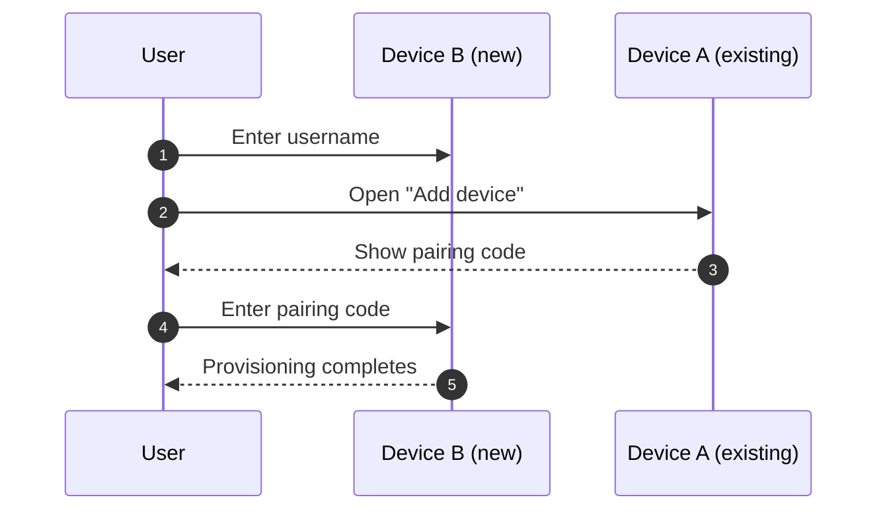

# Device provisioning

New devices are provisioned with a short out-of-band pairing code and a SPAKE exchange over server multicast.



## Multicast transport

Provisioning uses server multicast RPCs from [server](server.md):

- `v1_multicast_allocate(auth_token) -> channel_id`
- `v1_multicast_post(channel_id, blob) -> ()`
- `v1_multicast_poll(channel_id) -> blob | null`

Multicast contents are unauthenticated. The SPAKE exchange and AEAD payload protect integrity and confidentiality.

## Pairing code

Device A allocates `channel_id`, generates a random 32-bit `token`, and encodes `(channel_id, token)` into a single unsigned integer `code`.

Encoding:

1. Start with bit `1`.
2. Append Elias-delta coding of `(channel_id + 1)`.
3. Append the full 32 bits of `token`.

If this bitstring exceeds 64 bits, provisioning must fail and A must retry with a new channel.

User-facing code strings may include separators (for example spaces or dashes), but decoding must recover the same integer `code`.

## SPAKE handshake

Both devices initialize SPAKE with:

- password: decimal string form of `code`
- identity: username string (for example `@alice`)

Message flow on the multicast channel:

1. A posts `v1.provision_helo`.
2. B polls until it receives `v1.provision_helo`, then posts `v1.provision_ehlo`.
3. A polls until it receives `v1.provision_ehlo`.
4. Both sides finish SPAKE and derive the same 32-byte shared key.

If no completion happens quickly, A rotates to a fresh `(channel_id, token)` and displays a new code. A practical default is 15 seconds per attempt.

## Blob payloads

`v1.provision_helo` and `v1.provision_ehlo` use:

```json
{ "spake_msg": "base64url-encoded 33-byte value" }
```

`v1.provision_finish` uses:

```json
{
  "nonce": "base64url-encoded 24-byte nonce",
  "ciphertext": "base64url-encoded bytes"
}
```

The ciphertext is XChaCha20-Poly1305 over a JSON body using:

- key: SPAKE shared key
- nonce: `nonce` field
- associated data: empty bytes

Plaintext JSON:

```json
{
  "device_secret": "...",
  "add_device_action": "..."
}
```

`add_device_action` is a prepared transition of the shape:

`[username_key, nonce, signer_pk, action, next_user_descriptor, signature]`

## Receiver completion (device B)

After decrypting `v1.provision_finish`, B must:

1. verify the decrypted username matches the login username;
2. verify the action is add-device for the decrypted device secret;
3. submit the prepared action to the directory;
4. verify the new device is active and not expired in the resulting descriptor;
5. authenticate to the bound server and publish medium-term keys.

This completes provisioning.
