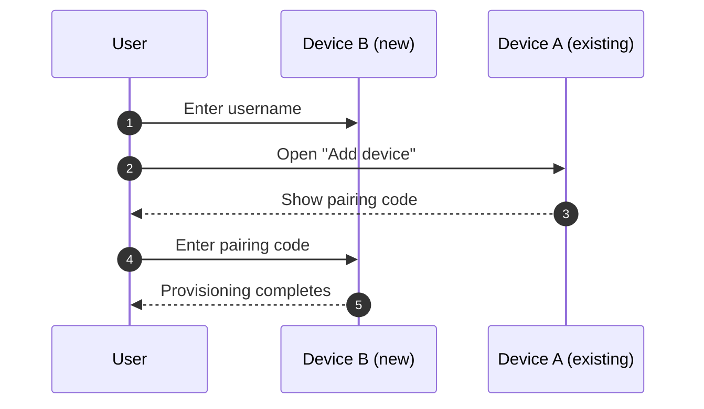

# Device provisioning

New devices are provisioned with a short out-of-band pairing code and a SPAKE exchange over a server bidirectional channel.


```mermaid
sequenceDiagram
  autonumber
  participant U as User
  participant B as Device B (new)
  participant A as Device A (existing)

  U->>B: Enter username
  U->>A: Open "Add device"
  A-->>U: Show pairing code
  U->>B: Enter pairing code
  B-->>U: Provisioning completes
```

## Bidirectional channel transport

Provisioning uses server channel RPCs from the [server RPC](../rpc/server.md):

- `chan_allocate(auth_token) -> channel_id`
- `chan_send(channel_id, direction, blob) -> ()`
- `chan_recv(channel_id, direction) -> blob | null`

Channel contents are unauthenticated. The SPAKE exchange and AEAD payload protect integrity and confidentiality.

Direction convention for provisioning:

- `forward` means A -> B
- `backward` means B -> A

## Pairing code

Device A allocates `channel_id`, generates a random 32-bit `token`, and encodes `(channel_id, token)` into a single unsigned integer `code`.

Encoding:

1. Start with bit `1`.
2. Append Elias-delta coding of `(channel_id + 1)`.
3. Append the full 32 bits of `token`.

If this bitstring exceeds 64 bits, provisioning must fail and A must retry with a new channel.

User-facing code strings may include separators (for example spaces or dashes), but decoding must recover the same integer `code`.

## SPAKE handshake

Both devices initialize SPAKE with:

- password: decimal string form of `code`
- identity: username string (for example `@alice`)

Message flow on the bidirectional channel:

1. A sends `{"kind":"helo","spake_msg":...}` on `forward`.
2. B polls `forward` until it receives `{"kind":"helo","spake_msg":...}`, then sends `{"kind":"ehlo","spake_msg":...}` on `backward`.
3. A polls `backward` until it receives `{"kind":"ehlo","spake_msg":...}`.
4. Both sides finish SPAKE and derive the same 32-byte shared key.

If no completion happens, the host-side attempt expires after 60 seconds. While waiting, A reposts `helo` every 5 seconds, and B polls the channel every 1.5 seconds.

## Blob payloads

Handshake messages use:

```json
{ "kind": "helo", "spake_msg": "base64url-encoded 33-byte value" }
```

or:

```json
{ "kind": "ehlo", "spake_msg": "base64url-encoded 33-byte value" }
```

The finish message uses:

```json
{
  "kind": "finish",
  "envelope": {
    "nonce": "base64url-encoded 24-byte nonce",
    "ciphertext": "base64url-encoded bytes"
  }
}
```

The ciphertext is XChaCha20-Poly1305 over a JSON body using:

- key: SPAKE shared key
- nonce: `envelope.nonce`
- associated data: empty bytes

Plaintext JSON:

```json
{
  "bundle_attachment": "..."
}
```

`bundle_attachment` is a normal attachment object whose payload is the provisioning bundle.

The bundle payload includes:

- `device_secret`
- `add_device_update`
- `dm_mailbox_key`
- recent local conversation history
- current group state, including the current group bearer keys
- mailbox cursors for imported mailboxes

`add_device_update` is a signed raw directory update of the shape:

`[username_key, nonce, signer_pk, owners, value, signature]`

## Receiver completion (device B)

After decrypting the finish payload, B must:

1. download and decode the bundle attachment;
2. verify the signed update targets that username and adds the decrypted device key;
3. submit the signed update to the directory;
4. verify the new device is present in the resulting descriptor;
5. authenticate to the bound server, publish medium-term keys, create or fetch the DM mailbox using `dm_mailbox_key`, and import the transferred local state.

This completes provisioning.
